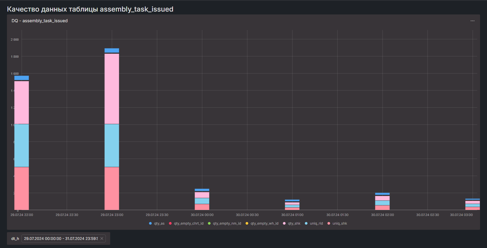

# ДЗ Data Quality
собрать метрики качества данных по вашей таблице в локальном клике в таблицу.
поднять DataLens. Делается тремя командами:
```bash
git clone https://github.com/datalens-tech/datalens
```
```bash
cd datalens
```
```bash
docker compose up
```

Добавить clickhouse в сеть DataLens, либо использовать ip-адрес в подключении
Отрисовать дашборд с метриками качества данных

В гит выложить:
sql-запрос на сбор метрик качества данных
скрин дашборда

# Результаты выполнения
1. SQL-запрос представлен в файле [script_ch.sql](script_ch.sql)
2. Скрин дашборда представлен ниже:
    
